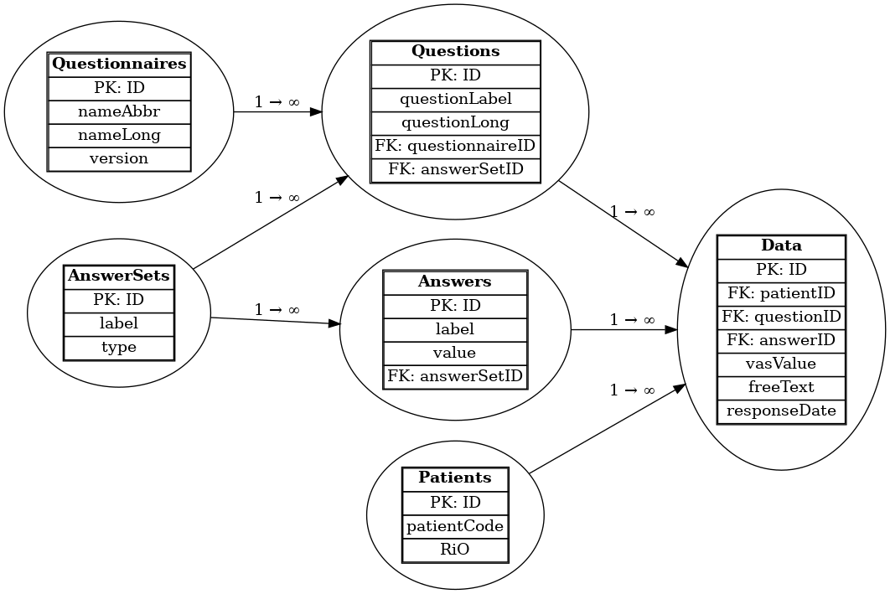
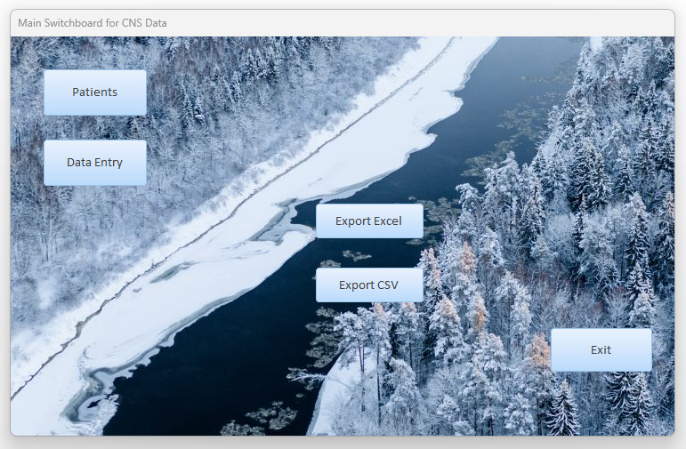
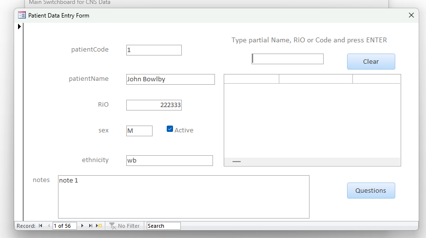
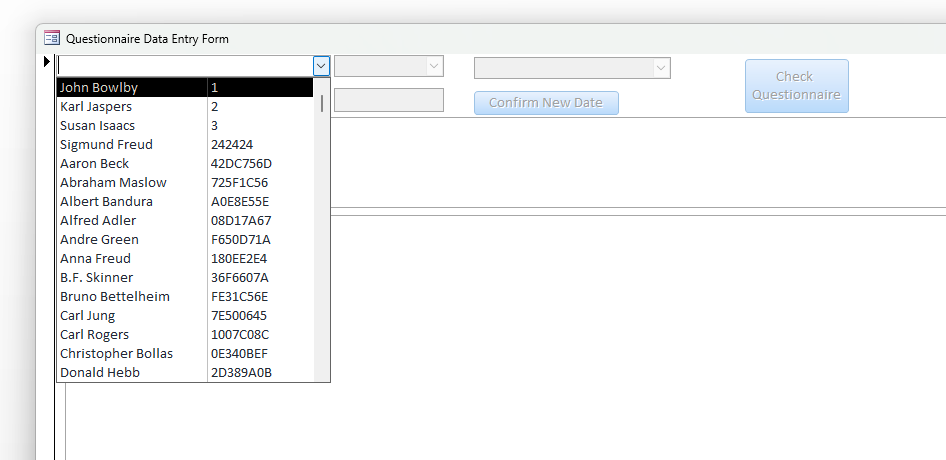
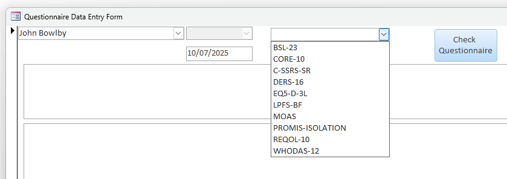
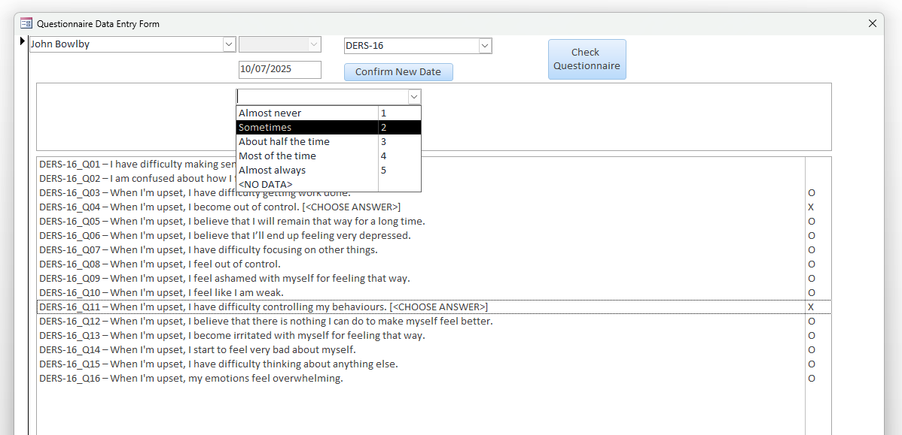

This repository contains the Microsoft Access application, its exported source code and structure. It is designed for structured data entry from patient questionnaire responses to follow the patient related outcome measures (PROMS) that are relevant to Complex Needs services. We call this data set [ICHOM](https://www.ichom.org/patient-centered-outcome-measure/personality-disorders/)+ it contains measures selected as valid by clinicians and patients across a sigificant number of countries. Regularly analyzing outcome data helps not only patient care and service improvement but also national and international benchmarking.

## Rationale for the Psychotherapy Data Entry Database

This database project was developed to address a critical inefficiency in the workflow of collecting and analyzing patient feedback within psychotherapy or personality disorder services. Traditionally, patients complete paper questionnaires, which are later transcribed into digital format:typically Excel:by administrative or assistant psychology staff. This process is not only time-consuming but also error-prone, especially when dealing with multiple questionnaires and a high volume of questions.

Spreadsheets, while familiar, present significant limitations. As questionnaires accumulate, they either grow horizontally into unreadable, unwieldy files or are split into multiple tabs, which makes analysis hard and complicates any attempt at automated analysis. Spreadsheet data validation, formula maintenance, and layout management become increasingly fragile, raising the risk of data loss or corruption. The result is a system where reliable analysis is difficult, slow, and often has to be repeated from scratch, delaying valuable feedback to clinicians and patients alike.

To solve this, we designed a Microsoft Access database grounded in principles of data normalization and long-format storage. In long format, each row represents a single patient response to a single question, capturing relevant metadata such as patient ID, questionnaire, date, and answer. This structure is ideal for automation and data integrity, supporting scalable and consistent analysis across time and individuals.

The database enables efficient, error-resistant data entry through structured forms. The operator selects a patient, specifies a date, and chooses a questionnaire; the system then presents the relevant questions with dropdown menus constrained by predefined answer sets. These answer sets reflect the expected response format:Likert scales, numerical ratings, etc.:and enforce consistency. Crucially, the system flags missing or invalid responses before completion, helping ensure data quality at the point of entry.

Once data is collected, exporting it to a clean, rectangular table in CSV or Excel format takes seconds. These exports are immediately ready for analysis using standard statistical packages (e.g., R, SPSS). With predefined scripts, a well-formatted report showing individual or group symptom trajectories can be produced in under a minute:transforming what used to take an assistant psychologist a week into a near-instant process. This enables services to offer rapid feedback to patients, monitor treatment effectiveness continuously, and make evidence-informed adjustments in real time.

In sum, this system transforms patient feedback collection from a manual, error-prone process into a robust, scalable data pipeline. It saves staff time, enhances data quality, and:most importantly:makes timely and meaningful clinical feedback feasible within routine care.

## Normalized data

A normalized data schema is essential for ensuring that the database is efficient, consistent, and scalable. By organizing information into logically related tables:such as patients, questionnaires, questions, and responses:redundant data entry is minimized and the risk of inconsistency is reduced. This structure supports reliable data validation and makes it easier to maintain and extend the system over time. In contexts where accurate linkage between responses, questions, and patients is critical, normalization provides a clear framework for enforcing data integrity and supporting robust reporting.

Above illustration lists all the database tables and defines relationships between them. These ensure referential integrity of data.

# **Database Workflow Overview**

Initial view of the database is simplified to remove the visual clutter and to allow focusing just on the data entry and export. If desired full interface with access to tables, queries, e.t.c. can be accessed using standard access bypass keys on opening (e.g. shift).

## **Main Switchboard Form**

 

Upon opening the database, a simplified user interface is shown.
- The **Main Switchboard** form includes:
  - `Patients` : opens the patient management form
  - `Data Entry` : opens the main form for entering questionnaire data
  - `Export to Excel` : exports all data as `.xlsx`
  - `Export to CSV` : exports all data as `.csv` (preferred for analysis)
  - `Exit` : closes the application

## **Patient Form (`frmPatients`)**

### **Purpose**
Used to add or edit patient records.

### **Features**
- Loads with the first patient record displayed
- **Search field** allows filtering by:
  - Patient name (partial match)
  - Real number
  - Patient code
- **Demographic fields**:
  - Patient code
  - Real number
  - Free text notes
  - Sex
  - Ethnicity (currently free-text)
  - `Active` checkbox : marks whether patient is currently in treatment

### **Navigation**
- Click on a patient in the search results to load their details.
- Use the `Questions` button to jump directly to the data entry form with that patient preloaded.
- Use `Clear` to reset the form for a new search or to add a new patient.

## **Data Entry Form (`frmDataEntryList`)**

### **Initial State**
- Opens blank with most controls disabled.
- The **patient selection combo box** is enabled.

### **Step-by-Step Workflow**
1. **Select patient**
   - Click or type the first few letters to find the patient.
   - Selecting a patient enables the date controls.

2. **Select or enter response date**
   - Use dropdown for existing dates or the just-below calendar/date field to enter new one.
   - Press `Confirm New Date` to confirm selection.

3. **Select questionnaire**
   - Once the date is confirmed, the questionnaire dropdown becomes active.
   - Selecting a questionnaire loads its questions below.

4. **Answer questions**
   - Click each question.
   - If it uses a dropdown (e.g., Likert scale), select the appropriate answer.
   - Status indicators:
     - `O` = unanswered
     - `X` = placeholder ("choose answer")
     - blank = valid answer
   - "No data" is a valid answer for unanswered items.
   

5. **Check questionnaire**
   - Press `Check Questionnaire` to verify completeness and validity.
   - Prompts a message box with results.
   - Encouraged before switching questionnaires.

6. **Switch questionnaires**
   - Simply pick a new one from the dropdown to continue entering for same patient/date.

## **Answer Types Supported**

- **Likert / Ordinal scales** : dropdown selection
- **Numeric inputs** : e.g., visual analog scale (VAS)
  - Requires direct numeric entry into the input field
- **Free text** : e.g., Columbia Scale comments
  - Opens a text box for transcription
- **Yes/No questions** : dropdown selection
- **"No data"** : valid entry for missing patient responses

## **Exporting Data**

### How to Export
- Press either:
  - `Export to Excel` or
  - `Export to CSV` (recommended for R/SPSS analysis)
- A folder selection dialog opens.
- Choose destination directory and confirm.
- A message displays the exact export path.

### Export Characteristics

- Includes all data (can be a few thousand rows - if more than that we can restrict reports by date ranges and just active patients too)
- Uniform tabular format for compatibility with:
  - **R data analysis scripts** : fast, predefined scripts can output results in well-formatted PDF files ready for:
    - discussion with patients
    - clinical team meetings
    - upload to RiO
  - **SPSS syntax** : for users more familiar with SPSS, the same data can be analyzed using custom syntax files
  - **Automated report generation** : timelines, progress graphs, and summary statistics can be produced via R (which is free, open source, and can be installed on Trust computers) or SPSS or any other reputable data analysis software
  - **Excel-based analysis** : exported data can be opened directly in Excel:
    - With the top-left cell active (default on opening), press `Shift + Ctrl + End` to select all data
    - On the ribbon, choose **Insert > Table** and ensure :My table has headers: is ticked
    - The data is now ready for filtering, summarising, creating graphs, or any other Excel-based analysis
  - If, in future, **Trust-wide integration** is desired, our well-structured dataset can be easily imported into other databases or centralized data platforms

## Closing the Application

- Forms can be closed via the standard window close button (`X` in top right).
- Use the **Exit** button on the switchboard to fully close the application.

## Table structure

`fk` in table name indicated _Foreign Key_ - that links the table to another table's _Primary Key_ - thus allowing to establish/maintain relational integrity. In the scheme above you can see that one side of the link contains 1, the other horizontal 8. It means one-to-many - there can be only one record of this kind in one table (identified with _pk_), but it can be related (bound to with _fk_) to many records in the other table.

### patients

- `ID` : Primary key  
- `patientCode` : Pseudonymized code (e.g. '023')  
- `patientName` : Name for operator convenience / human readability  
- `RiO` : actual patient ID in the clinical system  
- `sex` : demographic  
- `ethnicity` : demographic  
- `notes` : optional notes  

> Needless to say that any data with a real patient name and real RiO number _must NEVER be shared publicly_. All patient data in this database are test data and have been invented by ChatGPT.

### questionnaires

- `ID` : PRIMARY KEY  
- `nameAbbr` : Short abbreviation for the questionnaire - important, used in dropdown choices, etc.  
- `nameLong` : Full name of the questionnaire  
- `version` : Version label - in case we add a new version of the questionnaire - but that logic currently not implemented, needs thinking about.  
- `scoringInstructions` : Instructions regarding scoring this questionnaire - an important bit therefore separate from notes  
- `notes` : Any other notes regarding the questionnaire  
- `status` : questionnaire status - active, retired, archived, etc. We could later implement some logic based on this  

### questions

- `ID` : PRIMARY KEY  
- `questionCode` : Short code to question including questionnaire-name and question number within that questionnaire - \_Q01 \_Q02 etc.  
- `questionnaire` : Questionnaire name abbreviation for this question  
- `questionLong` : Full text of the question  
- `questionContext` : For some very long questions it is helpful to split the question context out of the question.  
- `questionType` : Question-Answer pair type e.g. Likert, Ordinal, Numeric e.t.c.  
- `order` : order of question within the questionnaire  - for quick sorting  
- `answerSetLabel` : label of the answer set for this question - was helpful in initial setup  
- `status` : question status - retired, archived, active etc. Questionnaires also have their status  
- `notes` : any notes about this particular question  
- `fkQuestionnaire` : lookup to Questionnaires  
- `fkAnswerSet` : lookup to AnswerSets  

### answerSets

- `ID` : PRIMARY KEY  
- `questionnaire` : questionnaire abbreviation - was used for initial setup  
- `label` : short text composed of questionnaire name and scoring direction  
- `scoreDirection` : textual label for scoring direction - just to make it very clear  
- `type` : question-answer type e.g. Likert, Ordinal, Text, VAS, Numeric  
- `notes` : Any notes one wants to make regarding the questionnaire answer sets  

### answers

- `ID` : PRIMARY KEY  
- `questionnaire` : questionnaire abbreviation this question-answer set belongs to - was used for initial setup  
- `answerScore` : score associated with this particular answer (as defined by the set)  
- `answerText` : text label of the answer  
- `questionType` : type of the question-answer pair e,g, Likert, Binary, etc.  
- `order` : order within the answer set (e.g. for sorting answer options in forms)  
- `answerSetLabel` : short text that indicates the questionnaire and whether this is forward or reverse scoring set  
- `fkAnswerSet` : lookup to AnswerSets  
- `isUtility` : flag to indicate this is a special answer e.g. `<NO DATA>`  

### data

- `ID` : PRIMARY KEY  
- `fkQuestion` : lookup (FK) to questions  
- `fkAnswer` : lookup (FK) to answers - for Likert/Ordinal questions  
- `fkPatient` : lookup (FK) to patients  
- `vasValue` : if answer in VAS - enter here 0 to 255 max range (byte), expected range 0 to 100  
- `freeText` : if free text answer required by some questions  
- `numericValue` : if numeric only answers required for some questions  
- `entryDate` : timestamp of entry (invisible to operator)  
- `responseDate` : date when response submitted (e.g. paper form)  
- `enteredBy` : operator's initials (optional)  
- `notes` : optional notes about the answer, operator may enter as they see fit  

## Future updates

As application gets used we will update this repository if we find any bugs or add features. However, we see this application as a transitory step to the system where users enter their responses directly into an online survey system (such as Limesurvey) and analysis program such as R takes care of automated data analysis and backup. In that case the Access application would be slightly redundant. We will take care to see that data structure in Access is compatible with the online one. That would allow us to collect data from *paper responses* too - if we still need to use paper. Data could be entred either via Access or inputting the answers directly into the online survey system.

One could say there could be a case for adding other questionnaires to this system, one could design some forms to ease that task. However the method of setting up questionnaire files as CSV files (see importable CSV folder) and then importing them into temporary tables and then inserting those records into `questionnaires, questions, answerSets and answers` tables would work too. One could also enter the new questionnaire bits in those same tables too.

Feel free to leave feedback on this database in the issues section of the repository.
